This is a walkthrough for the [Momentum: 1](https://www.vulnhub.com/entry/momentum-1,685/) boot2root machine on VulnHub.  
## Enumeration
Started off by performing some basic enumeration with nmap, nikto, and dirb.  
Ran nmap to enumerate services running on the target machine  
`sudo nmap -A -p- 10.0.3.58`
>Starting Nmap 7.93 ( https://nmap.org ) at 2023-07-22 16:13 EDT  
Nmap scan report for 10.0.3.58  
Host is up (0.00047s latency).  
Not shown: 65533 closed tcp ports (reset)  
PORT   STATE SERVICE VERSION  
**22/tcp open  ssh     OpenSSH 7.9p1 Debian 10+deb10u2 (protocol 2.0)**  
\| ssh-hostkey:   
\|   2048 5c8e2cccc1b03e7c0e2234d860314e62 (RSA)  
\|   256 81fdc64c5a500a27ea833864b98bbdc1 (ECDSA)  
\|_  256 c18f87c1520927605f2e2de0080372c8 (ED25519)  
**80/tcp open  http    Apache httpd 2.4.38 ((Debian))**  
\|_http-title: Momentum | Index   
\|_http-server-header: Apache/2.4.38 (Debian)  
MAC Address: 08:00:27:80:72:9C (Oracle VirtualBox virtual NIC)  
Device type: general purpose  
Running: Linux 4.X|5.X  
OS CPE: cpe:/o:linux:linux\_kernel:4 cpe:/o:linux:linux\_kernel:5  
OS details: Linux 4.15 - 5.6  
Network Distance: 1 hop  
Service Info: OS: Linux; CPE: cpe:/o:linux:linux_kernel  

Ran nikto to enumerate information and potential vulnerabilities for the web server running on port 80  
`sudo nikto -h http://10.0.3.58`
>\- Nikto v2.5.0  
\---------------------------------------------------------------------------  
\+ Target IP:          10.0.3.58  
\+ Target Hostname:    10.0.3.58  
\+ Target Port:        80  
\+ Start Time:         2023-07-22 16:14:50 (GMT-4)  
\---------------------------------------------------------------------------  
\+ Server: Apache/2.4.38 (Debian)  
\+ /: The anti-clickjacking X-Frame-Options header is not present. See: https://developer.mozilla.org/en-US/docs/Web/HTTP/Headers/X-Frame-Options  
\+ /: The X-Content-Type-Options header is not set. This could allow the user agent to render the content of the site in a different fashion to the MIME type. See: https://www.netsparker.com/web-vulnerability-scanner/vulnerabilities/missing-content-type-header/  
\+ No CGI Directories found (use '-C all' to force check all possible dirs)  
\+ /: Server may leak inodes via ETags, header found with file /, inode: 7d1, size: 5c086352f5b80, mtime: gzip. See: http://cve.mitre.org/cgi-bin/cvename.cgi?name=CVE-2003-1418  
\+ Apache/2.4.38 appears to be outdated (current is at least Apache/2.4.54). Apache 2.2.34 is the EOL for the 2.x branch.  
\+ OPTIONS: Allowed HTTP Methods: POST, OPTIONS, HEAD, GET .  
\+ /css/: Directory indexing found.  
\+ /css/: This might be interesting.  
\+ /img/: Directory indexing found.  
\+ /img/: This might be interesting.  
\+ /manual/: Web server manual found.  
\+ /manual/images/: Directory indexing found.  
\+ /icons/README: Apache default file found. See: https://www.vntweb.co.uk/apache-restricting-access-to-iconsreadme/  
\+ 8102 requests: 0 error(s) and 12 item(s) reported on remote host  
\+ End Time:           2023-07-22 16:15:06 (GMT-4) (16 seconds)  
\---------------------------------------------------------------------------  
\+ 1 host(s) tested  

Ran dirb to bruteforce for common web directory names, file names, and file extensions.  
>\-----------------  
DIRB v2.22    
By The Dark Raver  
\-----------------  
>  
START_TIME: Sat Jul 22 16:15:10 2023  
URL_BASE: http://10.0.3.58/  
WORDLIST_FILES: /usr/share/wordlists/dirb/common.txt  
EXTENSIONS_FILE: /usr/share/wordlists/dirb/extensions_common.txt | ()(.asp)(.aspx)(.bat)(.c)(.cfm)(.cgi)(.com)(.dll)(.exe)(.htm)(.html)(.inc)(.jhtml)(.jsa)(.jsp)(.log)(.mdb)(.nsf)(.php)(.phtml)(.pl)(.reg)(.sh)(.shtml)(.sql)(.txt)(.xml)(/) [NUM = 29]  
>  
\-----------------  
>  
GENERATED WORDS: 4612                                                          
>  
\---- Scanning URL: http://10.0.3.58/ ----  
==> DIRECTORY: http://10.0.3.58/css/                                                                                               
\+ http://10.0.3.58/css/ (CODE:200|SIZE:928)                                                                                        
\+ http://10.0.3.58/icons/ (CODE:403|SIZE:274)                                                                                      
==> DIRECTORY: http://10.0.3.58/img/                                                                                               
\+ http://10.0.3.58/img/ (CODE:200|SIZE:1492)                                                                                       
\+ http://10.0.3.58/index.html (CODE:200|SIZE:2001)                                                                                 
\+ http://10.0.3.58/index.html (CODE:200|SIZE:2001)                                                                                 
==> DIRECTORY: http://10.0.3.58/js/                                                                                                
\+ http://10.0.3.58/js/ (CODE:200|SIZE:925)                                                                                         
==> DIRECTORY: http://10.0.3.58/manual/                                                                                            
\+ http://10.0.3.58/manual/ (CODE:200|SIZE:626)                                                                                     
\+ http://10.0.3.58/server-status (CODE:403|SIZE:274)                                                                               
\+ http://10.0.3.58/server-status/ (CODE:403|SIZE:274)                                                                              
>                                                                                                                                   
\---- Entering directory: http://10.0.3.58/css/ ----  
(!) WARNING: Directory IS LISTABLE. No need to scan it.                        
    (Use mode '-w' if you want to scan it anyway)
>                                                                                                                                   
\---- Entering directory: http://10.0.3.58/img/ ----  
(!) WARNING: Directory IS LISTABLE. No need to scan it.                        
    (Use mode '-w' if you want to scan it anyway)
>                                                                                                                                   
\---- Entering directory: http://10.0.3.58/js/ ----  
(!) WARNING: Directory IS LISTABLE. No need to scan it.                        
    (Use mode '-w' if you want to scan it anyway)
>                                                                                                                                   
\---- Entering directory: http://10.0.3.58/manual/ ----  

Took a look at the website homepage:  
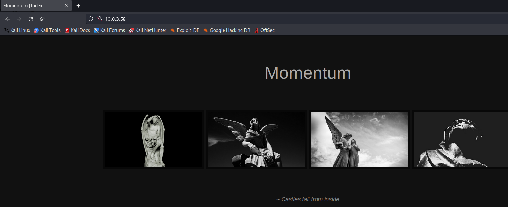  
It appears to be a simple image gallery.  

Clicking on one of the images leads to a page that displays the selected image and information about it:  
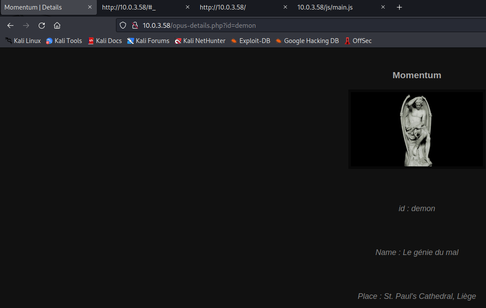  

Looked under the hood at the homepage source code:  
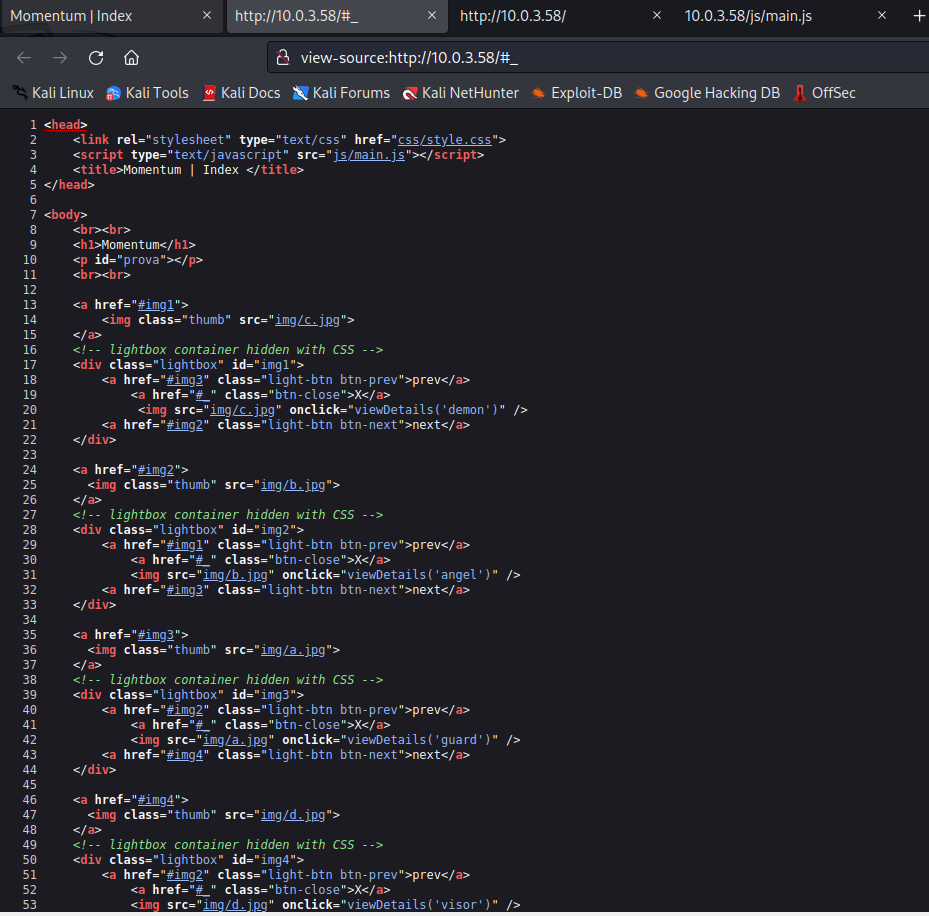  
There's a javascript function named "viewDetails" that gets called when the onclick event is triggered.  

The homepage is referencing a JavaScript file named "main.js", let's have a look at the source code of it:  
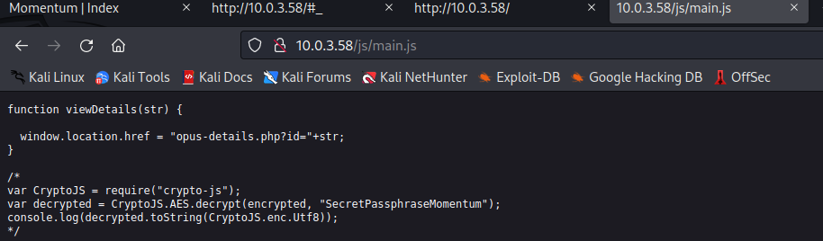  
The source code contains a commented out script block that uses the crypto-js library to decrypt an encrypted string and print the decrypted string to console.  

I spent some time going down a rabbithole thinking that perhaps one of the image names (angel, demon, etc) was the username and that the password was an encrypted string of the text from one of the images in the image gallery. I had reversed the code to encrypt a string and output it and was bruteforcing SSH.  
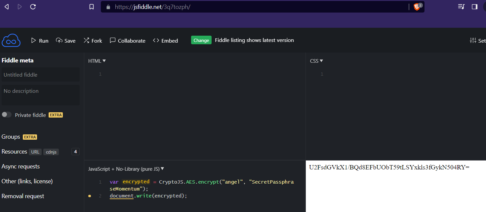  

After remembering to adhere to the KISS method, I looked in developer tools and noticed that the cookie value looks a lot like the encrypted strings I'd been generating.  
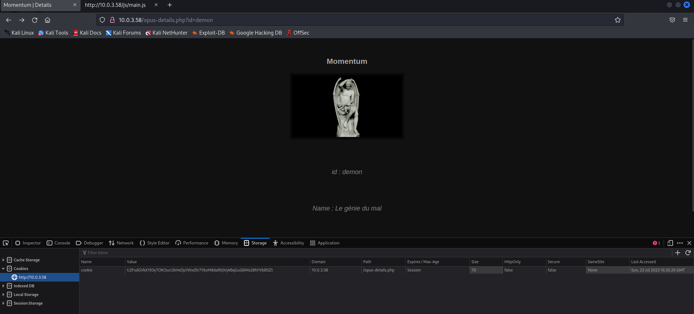  

The cookie value decrypted to a series of numbers... Perhaps these are decimal codes for ASCII characters!  
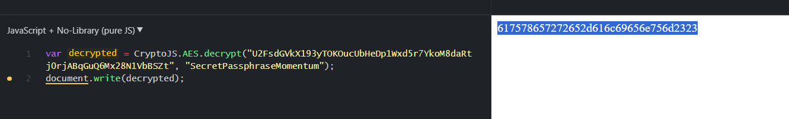  

Placed the decrypted string into the ASCII converter at dcode.fr:  
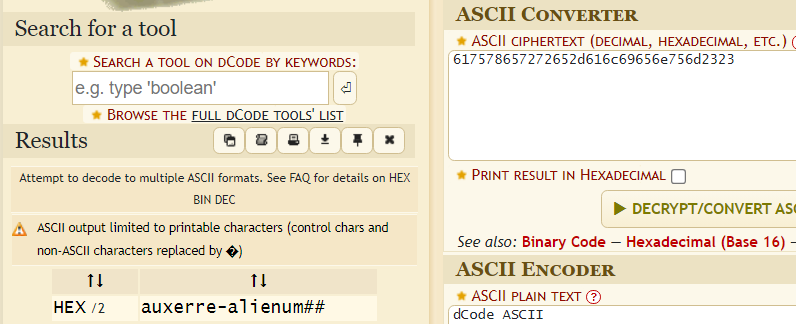  
The string decodes to `auxerre-alienum##`

I put together a wordlist with all the information I'd amassed so far and was able to successfully bruteforce the SSH credentials:  
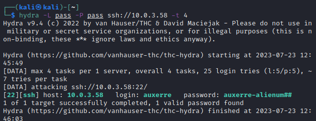  

### user.txt flag
Successfully authenticated to SSH as auxerre and captured the user.txt flag  
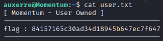

## Privilege Escalation
Transferred over and ran linpeas.sh on the target machine. Discovered that there is a redis server running and listening on the local loopback interface:  
>**redis      381  0.0  0.5  51672 11752 ?        Ssl  12:32   0:01 /usr/bin/redis-server 127.0.0.1:6379**  
[snip]  
╔══════════╣ Analyzing Redis Files (limit 70)  
Redis server v=5.0.3 sha=00000000:0 malloc=jemalloc-5.1.0 bits=64 build=94145a25ce04923  
**Redis isn't password protected**  
-rw-r-\--\-- 1 redis redis 62226 Feb 25  2021 /etc/redis/redis.conf  

Utilized the built-in redis-cli utility on the target machine to connect to the redis server:  
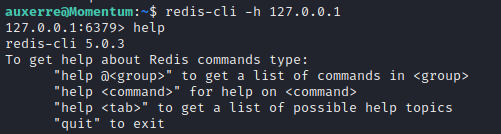  

Enumerated the database and keyspace, and obtained the value for the "rootpass" key:  
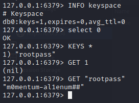  

Ran su and used `m0mentum-al1enum##` for the root password:  
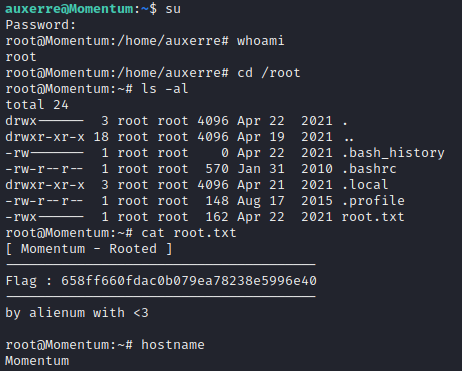  
Got root!  

### root.txt flag
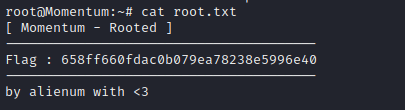
